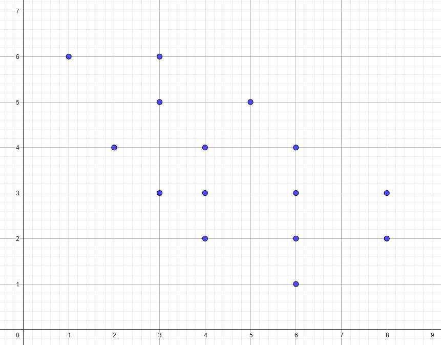
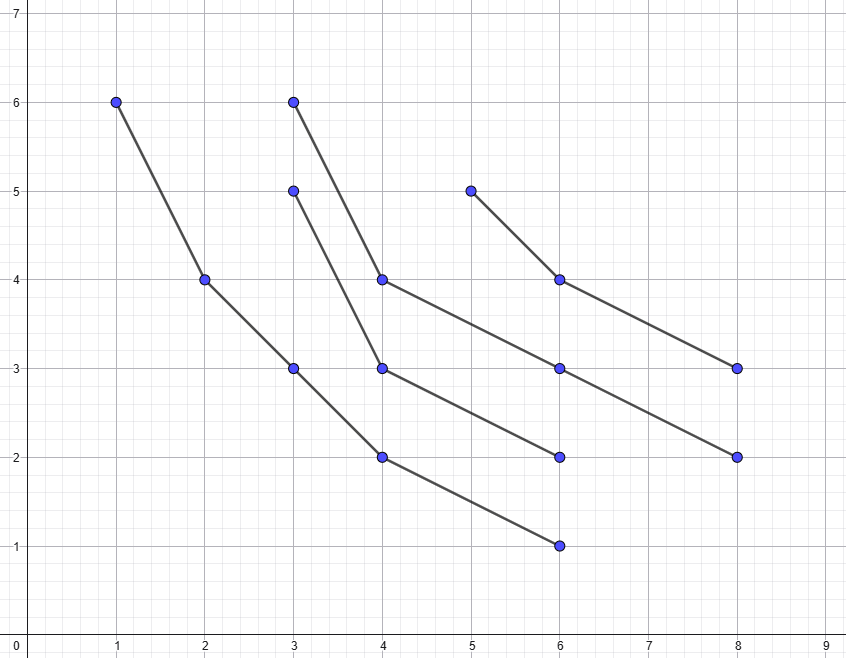

## Mục lục

# Giới thiệu về Thuật toán Non-Dominated Sorting Genetic Algorithm 2 (NSGA-II)

Thuật toán tiến hóa là một thuật toán giải gần đúng bài toán tối đa hóa đa mục tiêu.

**Ví dụ:** Bài toán **TSP** mở rộng

> Một người từ thành phố $1$ muốn tham quan các thành phố $2, 3, .. n$ và quay trở lại thành phố ban đầu, biết chi phí di chuyển và thời gian di chuyển giữa mỗi thành phố, tìm hành trình tốn ít chi phí nhất và tốn ít thời gian nhất.

## Cá thể trong NSGA-II

Mỗi cá thể trong NSGA-II có 2 thuộc tính:

- `chromosome`: Kiểu gen, là một vector
- `fitness`: Giá trị thích nghi, là một **vector**

## Nhắc lại **khái niệm Tối ưu Pareto:**

### Lý thuyết

- Một điểm **$x_1$ được gọi là tối ưu hơn $x_2$** nếu giá trị ở mọi hàm mục tiêu ở điểm $x_1$ không tồi hơn giá trị ở mọi hàm mục tiêu ở điểm $x_2$ và tồn tại một hàm mục tiêu có giá trị tối ưu tốt hơn.
- **Điều kiện toán học:** $f_i(x_1) \le f_i(x_2) \forall i \text{ and } \exists i, j: f_i(x_1) < f_j(x_2)$
- $x_1$ chi phối $x_2$ (ký hiệu toán học là $x_1 \prec x_2$).
- **Biên Pareto:** Tập các điểm tối ưu (điểm được gọi là tối ưu khi không có điểm nào tối ưu hơn nó).

### Ví dụ:

|   $x_1$   |   $x_2$   |        So sánh         |
| :-------: | :-------: | :--------------------: |
|  (1, 2)   |  (1, 3)   |    $x_1 \prec x_2$     |
| (1, 2, 5) | (2, 1, 4) | Không cái nào trội hơn |

## Mã giả:

```bash
Khởi tạo quần thể có N kiểu gen
Tính độ thích nghi (fitness) của từng cá thể
while (chưa đạt điều kiện dừng) do:
    Chọn các cá thể từ quần thể hiện tại làm cá thể cha mẹ
    while (chưa đạt N cá thể con) do:
        Tiến hành lai ghép (crossover) với xác suất p_c
        Tiến hành đột biến (mutation) cá thể con với xác suất p_m
    Sắp xếp không trội
    Tính khoảng cách mật độ
    Chọn lọc sinh tồn
```

## Các kiểu mã hóa

[Giống với GA](../GA/Readme.md)

## Cách chọn lọc cha mẹ

[Giống với GA](../GA/Readme.md)

## Các kiểu lai ghép

[Giống với GA](../GA/Readme.md)

## Các kiểu đột biến

[Giống với GA](../GA/Readme.md)

## Sắp xếp không trội

**Mã giả**

```python
Input: Quần thể P gồm N cá thể chưa được xếp hạng
Output: Quần thể P được xếp hạng thành tập không trội F_0, F_1, ...

Chú giải:
- S_p: danh sách các cá thể mà p trội hơn
- n_p: số cá thể trội hơn p

begin
    F = []
    F_0 = []
    for p in P:
        Tìm S_p, n_p
        if n_p == 0:
            F_0.append(p)
    F.append(F_0)

    i = 0
    while F[i] is not empty:
        Q = []
        for p in F[i]:
            for q in S_p:
                n_q -= 1
                if n_q == 0:
                    Q.append(q)
        i += 1
        F.append(Q)
    return F
end
```

**Ví dụ mô phỏng**

Đầu vào: Tập các điểm P


Đầu ra: Các điểm được phân lớp


## Tính khoảng cách mật độ

**Mã giả**

```python
Input: Các cá thể trên biên không trội F_k
Output: Các giá trị khoảng cách cho từng cá thể thuộc F_k

Chú thích:
- f[f_1(x), f_2(x), ..., f_n(x)]: Các hàm mục tiêu cần tối thiểu hóa
begin
    L_k = len(F_k) # Số lượng cá thể
    D = []         # Khảng cách mật độ tương ứng với mỗi cá thể
    for i in range(L_k):
        D.append(0)
    for f_j in f:
        Q_j = sort(F_k, f_j)  # Sắp xếp theo giá trị f_j(x)
    ....
end
```

## Chọn lọc sinh tồn

### Mã giả

```bash

```

# Tài liệu tham khảo

- [Tính toán tiến hóa (Quyển 3) - Huỳnh Thị Thanh Bình](https://nxbbachkhoa.vn/ebook/12382)
